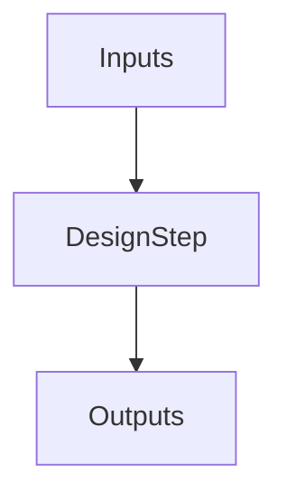

# Digital VLSI SoC Design and Planning program (December 11 - December 24)-By Srujan Prasad 

## Overview of this repository : 
This repository contains all the necessary details regarding the SoC design and planning that involves executing all the necessary steps starting from understanding the basics such as application softwares,
going all the way to the floor planning,layout generation,timing analsyis and finally knowing about the foundry which is the Google Skywater 130nm technology.

## Installation of Virtual Box and Openlane


## DAY-1 - Introduction to the Open Source EDA,OpenLane and Sky 130 PDK (Module-1 and Module-2)

This course starts with giving an introduction the Open Source EDA and most importantly about the Openlane and sky 130 process design kit.

<details>

<summary>Some theory</summary>
- Arduino is the most commonly used Microcontroller for various projects.So the chip that can be fabricrated at the end of all the process can be used in iwatches,arduino microcontrollers and so on.
Below is the image of the arduino microcontroller,


- System Software is a software that handles the input/output operations,allocates memory and performs the low level system functions.
  * The C code is compiled by a compiler
  * The output of the compiler is passed thorugh an assembler where it is converted into hexadecimal code (assembly code)
  * This is then converted to the binary form so that hardware can understand and perform the desired operation.The steps are shown in the image below : 


Open Lane Flow : 


</details>

## DAY-1 - Getting familiar with Open Lane (Module-3)
- This module involved getting familiar with the open lane tool by first checking the version of the openlane,preparing it for further process and finally running of the synthesis.
- Below are commands that were run to invoke openlane and perform synthesis :

To invoke openlane : 
```
   cd ~/Desktop/work/tools/openlane_working_dir/openlane
   ls -ltr
   docker
   pwd
   ./flow.tcl -interactive
```

To check its version  :

```
  package require openlane 0.9
```
To perform preparation  :
```
prep -design picorv32a

```
Finally to run the synthesis 
```
run_synthesis
```
Below are some of the images : 


Creation of folder : 


- Another thing is the flop ratio.Flop ratio is defined as the ratio of the number of D flip flops to the total number of cells i.e ,
```math
Flop\ Ratio = \frac{Number\ of\ D\ Flip\ Flops}{Total\ Number\ of\ Cells}
```


- So here the number of D flip flops are equal to **1613** and the total number of cells are equal to **14876**.Then the flop ratio becomes:

```math
Flop\ Ratio = \frac{1613}{14876}
```
 = 0.1084 or 10.84% 

## DAY-2 - Good floorplan VS Bad Floorplan and introduction to library cells

- This module involves understanding what is meant by utilization factor,aspect ratio and its significance in the physical design.
- A section of the silicon wafer is called as silicon die.

**Utilization factor** is defined as the ratio of the Area occupied by the netlist to the total area of the core.i.e,
```math
\text{Utilization Factor} = \frac{\text{Area Occupied by the Netlist}}{\text{Total Area Occupied by the Core}}
```
- Suppose the dimensions of a netlist are 2unit x 2unit and the dimensions of the core are 2unit x 2unit then the utilization factor is given by : 
  ```math
    \text{Utilization Factor}= \frac{2x2}{2x2}
  ```
  then the utilization factor = 1.This signifies that there is **100% utilization**.

  

  - Another important thing is the **aspect ratio**.Aspect ratio is defined as the ratio of the height to the width of the core.i.e,
```math
    \text{Aspect Ratio} = \frac{\text{Height}}{\text{Width}}
```
- Typically this aspect ratio is set to **1**.
- Few more points to consider are :
   - If the utilization factor is exactly equal to 1 then it is said to be 100% utilization and the core is of **square shape**.
   - If the utilization factor is equal to 0.5 then the core is of **rectangular shape**.
 
- Preplaced cells are the cells which are placed only once before the placement and routing as shown below :


- **Noise margin** is defined as the maximum amplitude that can be superimposed on all the nodes of a long chain of inverter such that it doesnot cause any change in the logic level of the output.

  

- As the signal propagates there are more chances of the signal to get degraded.So for this reason decoupling capacitors are used to get the exact output.

  
  
  - Whenever there is a switching happening the decoupling capacitor looses its charge to the main circuit.
  - When there is no switching happening the decoupling capacitor replenishes its own charge.

- Consider the signal 0001101000111001.Upon application of this input to the inverter the output becomes : 1110010111000110.i.e all the capacitors at logic 1 will discharge to the same ground point as they are tapped to the same ground.This causes a problem called as the **ground bounce**.
- Similarly,all the capacitors at logic 0 will charge towards the Vdd (supply) and a problem called **voltage drooping** arises,as shown below :

   Ground bounce:
   

  Voltage drooping:
  

- For this reason the recent chips have more than one supply points.

  

- The view of the power planning is shown below :

  

- Netlist is represents the connectivity.

  

- Final floorplan that is ready for the placement and routing step is shown below :

  

- ## Running Floorplan in OpenLane :

```
run_floorplan
```
```
cd ~/Desktop/work/tools/openlane_working_dir/openlane/designs/picorv32a/runs/15-12_09-29
ls -ltr
cd results/floorplan
```


  - To view the results :

    ```
     magic - T ~/Desktop/work/tools/openlane_working_dir/pdks/sky130A/libs.tech/magic/sky130A.tech lef read .. /../tmp/merged. lef def read picorv32a. floorplan. def &
    ```


Created layout : 


**NOTE :** 
``` math
1 micron = 1000 database units
```
According to our specifications it is 660685 and 671405
So according to our constraints the dimensions are : 
``` math
  \text{Dimensions }= \frac{660685}{1000} = 660.6 microns
```
``` math
   \text{Dimensions }= \frac{671405}{1000} = 671.405 microns
```

- Also we need to place the blocks as close as possible to the input and output ports in order to reduce the delays.
- Optimize placement is the stage where we estimate the wire lengths,capacitors and so on.
- We use a repeater block to reproduce the original signal so that signal integrity will be maintained.These are nothing but the **buffers**.


- ## Running Placement in OpenLane :

 ```
cd results/floorplan
ls -ltr
cd ../placement/
ls
magic - T ~/Desktop/work/tools/openlane_working_dir/pdks/sky130A/libs.tech/magic/sky130A.tech lef read ../../tmp/merged. lef def read picorv32a.placement. def &
```


Below are the results : 


- Cell design flow involves the following steps :

  



- The most important thing is the timing constraints.We need to understand some timing variables,the terms such as rise time,fall time and the propagation delay.
   - **Rise time** is defined as the time taken to transition from 10% to 90 % of the final value whereas **fall time** is defined the time taken to transition from 90% to 10% of the final value.
   - Below are some of the variables involved :

      

   - **Propagation delay** is defined as the difference between the high level (fall or rise) and the low level (fall or rise).

      


## DAY-3 - Design Library using Magic Layout and NGSpice Characterization 

- So looking at the IO-Placer.We can change the environment variable by setting it to 2.

```
set ::env(FP_IO_MODE) 2
run_floorplan
```

We might see the below changes : 


- CMOS Inverter is a CMOS circuit which performs the basic logic inversion of the input signal.It is a robust (strong) circuit.
- Analysing a CMOS Inverter by plotting its VTC (Voltage Transfer Characteristics) using the Spicedeck which involves the following processes :
  
 ```mermaid
flowchart TD
    Component_Connectivity --> Component_Values
    Component_Values --> Identify_Nodes
    Identify_Nodes --> Name_the_Nodes
```

  


  

- ### Cloning the github

  

  Copying the sk130A.tech file to the github repository that we have just cloned :

  

- Layout of a CMOS Inverter is shown below :

  

- **CMOS Fabrication** process involves the following steps :
  - Select the substrate.
  - Create active regions for the transistor.
  - N-Well and P-well formation.
  - Formation of gate.
  - Lightly doped drain formation.
  - Source and drain formation.
  - Form interconnects and the contacts.
  - Higher level formation.

  The final fabricated CMOS is as shown below :

  

 - We can get to know about the particular section in a layout by placing our cursor on it and hitting S on our keyboard to select it.
 - We can then go to the tkcon window and type **''what''** to know about it.

    

    

- Below are the steps that need to be followed in order to create the spice file :
   - In the tkcon window type the following commands :
     ```
     extract all
     ext2spice cthreshold 0 rthreshold 0
     ext2spice
     ```

    

    In the terminal window : 
     
  ```
  cd ~/Desktop/work/tools/openlane_working_dir/openlane/vsdstdcelldesign
  ls -ltr
  vim sky130_inv.spice
  ```
  


  This opens the following :

  

  So the parameters are edited in the .spice file that is we first include the necessary libraries such as pshort.lib and nshort.lib and run the ngspice as shown in the below image :

  

  We then run the following command :

  ```
  ngspice sky130_inv.spice
  ngspice->plot y vs time a
  ```

  

  This opens the transient response as shown below :

  

  


  
  

